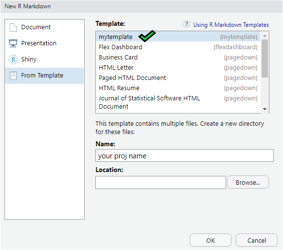

 
# "Template Title"

_author_: **[Niccolò Salvini](https://niccolosalvini.netlify.app/)**
_date_: `r format(Sys.Date(), "%d %B, %Y")`

<br> <br>

```{r global.options, include = FALSE}
library(knitr)
opts_chunk$set(
  cache       = FALSE,    # if TRUE knitr will cache the results to reuse in future knits
  fig.width   = 12,       # the width for plots created by code chunk
  fig.height  = 8,        # the height for plots created by code chunk
  fig.path    = "img/",   # file path to the directory where knitr DESTINATION shall store the graphics files
  results     = 'asis',   # knitr will pass through results without reformatting them
  echo        = TRUE,     # in FALSE knitr will not display code in the code chunk above it's results
  message     = TRUE,     # if FALSE knitr will not display any messages generated by code
  strip.white = TRUE,     # if FALSE knitr will not remove white spaces at the beg or end of code chunk
  warning     = FALSE)    # if FALSE knitr will not display any warning messages in the final document


## hook to center image
knitr::knit_hooks$set(imgcenter = function(before, options, envir){
  if (before) {
    htmltools::HTML("<p align='center'>")
  } else {
    htmltools::HTML("</p>")
  }
})


```


## Description:
This template is designed to speed up the process of compiling a decent and well organized (at least according to me) README.Rmd  .
It does that by formatting the global chunk options with the most common features and It also sets up a clear path/workflow to be assertive in explaning the project's aim. Moreover It gently pushes the project leader to split up main files into different files (.R , .bib) according to their respective unique goals (down the explanation). 


## Usage:
install it from my github repo:

```{r eval=FALSE}
library("devtools")
install_github("NiccoloSalvini/mytemplate")
```

Reload the session and then select `File -> New File -> R Markdown... -> From Template`

```{r graphics, echo=FALSE, imgcenter = TRUE}
 
```


<br> 

**pay attention**
Due to some reasons when you are calling the mytemplate as above the template will come packed into a folder that will take the name you set before, here in the image above "your proj name". I strongly suggest you to move elements in the main folder, so unpack them and delete the folder.

Once you have proceed with the step above save the newly appeared rmd file as 'README' (this is the correct commonly shared notation, all capital letters), do *not* specify the format, it will be **.Rmd** by default. Once you are ready with your readme finally *knit* it and then commit you stuff to master branch.
**IMPORTANT** : In order to change whatever into the README.md (the one shown scrolling down in the repo's front page) you should modify **ONLY** the README.Rmd , then once again *knit* it, at the end commit the stuff. This happens because GitHub can render only the .md format, that is generated by _knitting_ the .Rmd  . When you have _knitted_ your README you are able to fill the references.bib by uncommenting it in the YALM header.

## Main Features:

### 1. upper right logo

put your logo the _img_ folder
```


```
### 2. workflow organization:
I believe that each part of the code whose aim is defined should be contained in a singular file. 
3 files are initialized **reference.bib** where all the references are put. **libs.R** where all libraries are given so that dependencies are explicited and well organized. **utils.R** are common functions that allows the coder to be more productive and efficient, if you already have your personal package then you are not going to need it. It has the aim to gather all the user defined functions that are explicitly designed to help.
  
  
### 3. fig alignement centered: 
Given that github_document format does not center images, it has been developed a workaround to do it. The code directly interferes with the HTML which clear up the job. You just need to add to the singular chunk options the:  `imgcenter = TRUE` . It centers only locally saved images, so I strongly encourage you to initialize a folder where you store all of your images.
  
```{r leottona, echo=FALSE, imgcenter = TRUE}
 
```

### 4. TOC:
**T**able **O**f **C**ontent, easy way to scroll down through sections. Eeeasy. 
TOC depth is set = 3 I recommend you to leave him alone, nested paragraphs following the 3rd can become a _Matrioska_, and that is totally another game.

### 5. opts_chunk: 

- figures in output are centered 12X8
- cache can be set = TRUE when rendering becomes heavy 
- white space at the beginning & at the end are squished
- 3 files are created:
  - references.bib file for referenceses
  - libs.R for libraries
  - utils.R for userdefined iff you have not a personal package


```
knitr::opts_chunk$set(
  warning = FALSE,  
  strip.white = TRUE,     
  fig.path = "img/",
  fig.width=12,
  fig.height=8,
  cache = FALSE           
)

file.create("references.bib")
file.create("libs.R")
file.create("utils.R")

# libraries are in the libs.R pac
source(file ='libs.R')
# reusable functions are in the utils.R pack
source(file = "utils.R")

knitr::knit_hooks$set(imgcenter = function(before, options, envir){
  if (before) {
    HTML("<p align='center'>")
  } else {
    HTML("</p>")
  }
})

set.seed(27)
```


---
# General Structure


This is how to plainly explain a project, It takes a couple of step but then *questions*, I can assure, are not coming.

### Introduction:

### Deployment happens:

### Description:

### Visuals:

### Usage:

### Project Status:

### Next Features:

### License:

<a rel="license" href="http://creativecommons.org/licenses/by/4.0/"></a><br />Quest'opera è distribuita con Licenza <a rel="license" href="http://creativecommons.org/licenses/by/4.0/">Creative Commons Attribuzione 4.0 Internazionale</a>.

## References:
